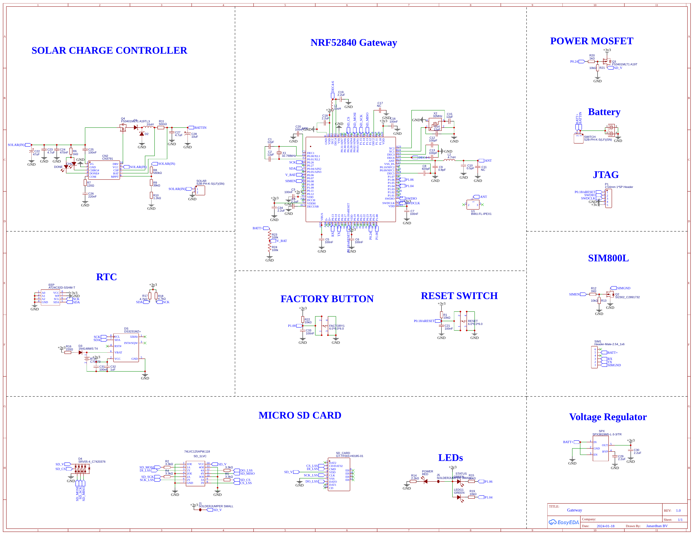
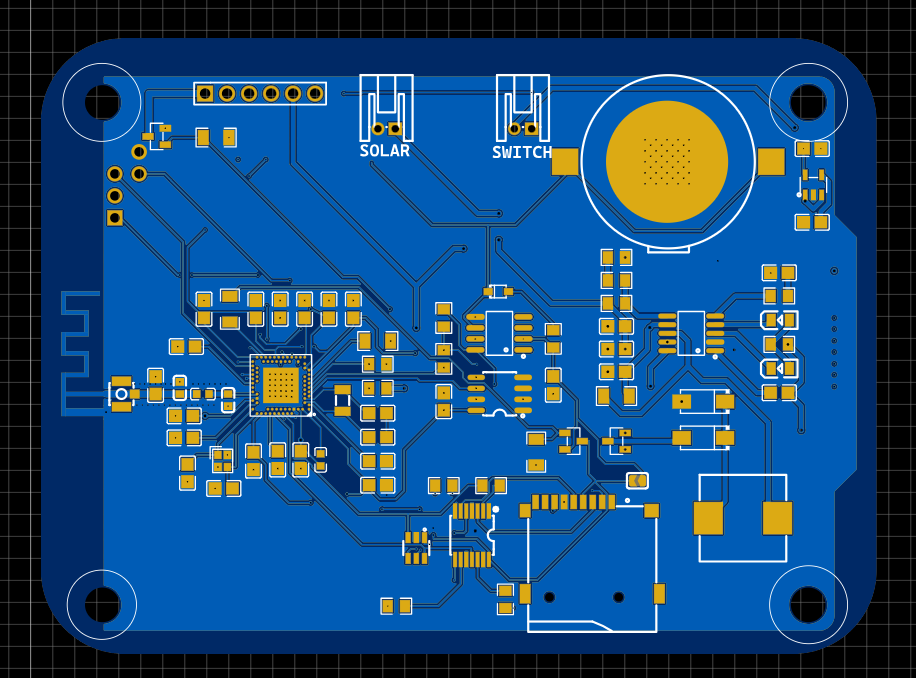
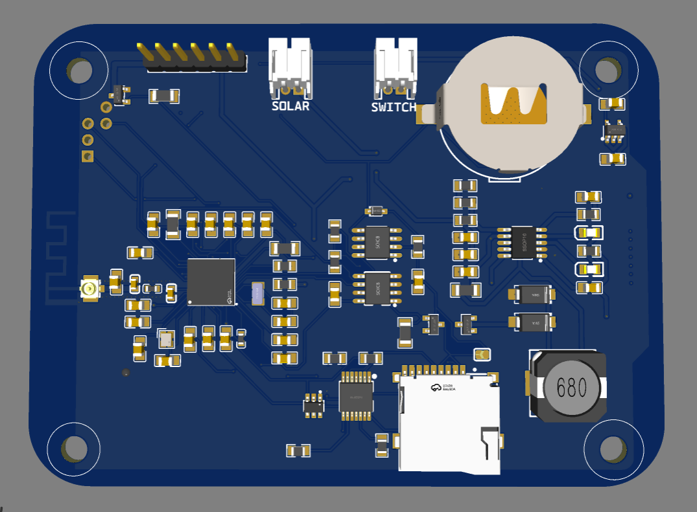
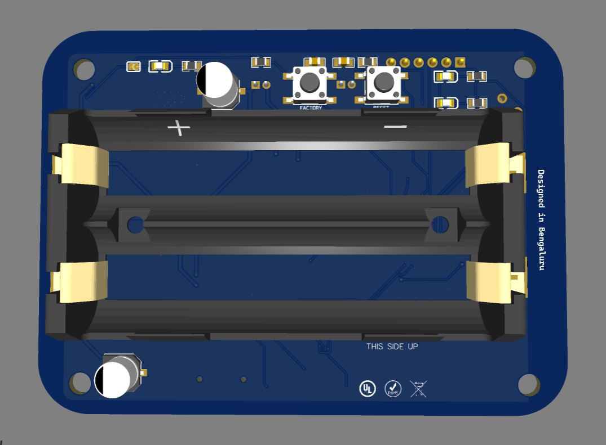

# Solar-Powered IoT Gateway — nRF52840 + GSM + SD Datalogger
---

## Project Overview

This is a **solar-powered, battery-backed IoT Gateway PCB** built around the **Nordic nRF52840** SoC (Bluetooth 5 + USB + 64 MHz Cortex-M4F). It integrates a complete off-grid power system with MPPT solar charging, 2× AA battery holders, GSM connectivity via SIM800L, timestamped microSD data logging via DS3231 RTC, EEPROM configuration storage, and a u.FL antenna connector — all on a compact square board with 4 mounting holes.

The board is designed for **remote outdoor IoT deployments** such as environmental monitoring, asset tracking, agricultural sensors, and smart metering — where grid power is unavailable and cellular connectivity is the only uplink.

**Key capabilities:**
-  **Solar MPPT charging** of LiPo/Li-ion battery via CN3791
-  **BLE 5.0 / NFC / USB** via nRF52840
-  **GSM 2G connectivity** via SIM800L (SMS, GPRS)
-  **MicroSD card** data logging (SPI, level-shifted via 74LVC125A)
-  **DS3231 RTC** with AT24C32 EEPROM for timestamped logging
-  **SWD JTAG** debug/programming header
-  **FACTORY + RESET** tactile buttons
-  **Power + Status LEDs**

---

##  Project Visuals

### Schematic


### PCB Layout


### 3D Board Top View


### 3D Board Bottom View


---

## System Architecture

```
Solar Panel Input (S2B-PH Connector)
      │
      ▼
CN3791 MPPT Solar Charge Controller
      │ (charges at up to 2A, 300 kHz PWM)
      ▼
2× AA Battery Holder (BT1 — bottom side)
      │  BATT+ rail
      ├──► SPX3819M5-L-3.3 LDO ──► +3v3 rail
      │
      └──► SIM800L (BATT+ directly, ~4V peak 2A)
                 │
          SIM Module Header (SIM1, 1×6 pin 2.54mm)

+3v3 rail powers:
  ├── nRF52840 (U_NRF) via VDD
  ├── DS3231MZ+ RTC
  ├── AT24C32D EEPROM
  ├── 74LVC125A (SD level shifter)
  └── SD Card (switched via FS3401 P-MOSFET)

nRF52840 SoC:
  ├── SPI ──► 74LVC125A ──► MicroSD Card
  ├── I2C ──► DS3231 RTC + AT24C32 EEPROM
  ├── UART ──► SIM800L GSM module
  ├── USB D+/D– (native USB full-speed)
  ├── SWD ──► JTAG debug header
  └── u.FL Antenna connector
```

---

## Component BOM

### Core ICs

| Ref | Part | Function |
|:---:|:---|:---|
| NRF | nRF52840 (aQFN-94) | BLE 5.0 + USB + Cortex-M4F SoC @ 64 MHz |
| CN2 | CN3791 | MPPT solar charge controller (up to 2A) |
| SPX | SPX3819M5-L-3.3 | 500mA LDO regulator — Battery → 3.3V |
| SD_1LVC | 74LVC125APW | Quad buffer — SD card SPI level shifting |
| DS | DS3231MZ+ | Ultra-precise ±2ppm I2C RTC with temperature |
| EEP | AT24C32D-SSHM-T | 32Kbit I2C EEPROM for config/calibration |
| SIM800L | SIM800L (via SIM1 header) | Quad-band 2G GSM/GPRS module |

### Power & Switching

| Ref | Part | Function |
|:---:|:---|:---|
| Q2 | SI2302 (C2891732) | N-MOSFET — SIM800L power enable (SIMEN) |
| Q3, Q4 | FS3401MLT1 A19T | P-MOSFET — SD card power switching (SD_V) |
| D3 | 1N4148WS | Schottky diode — RTC VBAT protection |
| D4 | SRV05-4 | TVS array — SD card ESD protection |
| BT1 | C70373 | 2× AA battery holder (bottom-mounted) |

### Connectors

| Ref | Part | Signals |
|:---:|:---|:---|
| SOLAR | S2B-PH-K-S (2-pin JST) | Solar panel input |
| SWITCH | S2B-PH-K-S (2-pin JST) | External power switch |
| SIM1 | HDR 1×6 2.54mm | SIM800L GSM module header |
| P1 | HDR 1×5 2.54mm | UART/GPIO expansion header |
| U1 | BWU.FL-IPEX1 | u.FL antenna connector (nRF52840 ANT) |
| JTAG | SWD header | SWD debug (SWDIO, SWDCLK, GND) |

### Crystals

| Ref | Frequency | Function |
|:---:|:---:|:---|
| X1 | 32.768 kHz | nRF52840 low-frequency crystal (RTC tick) |
| X2 | 32 MHz | nRF52840 high-frequency crystal (RF) |

---

## ⚡ Power Architecture

```
Solar Panel (5V–18V) ──► CN3791 MPPT ──► LiPo / 2×AA Battery (BATT+)
                                              │
                        ┌─────────────────────┼─────────────────────┐
                        ▼                     ▼                     ▼
              SPX3819M5 LDO           SI2302 MOSFET (Q2)     Direct BATT+
              (3.3V, 500mA)           SIM800L EN switching    (SIM800L VCC)
                    │
                 +3v3 rail
                    │
     ┌──────────────┼──────────────────────────────┐
     ▼              ▼              ▼               ▼
 nRF52840        DS3231         AT24C32        74LVC125 + SD
```

| Rail | Voltage | Source | Consumers |
|:---:|:---:|:---|:---|
| BATT+ | 3.5–4.2V | CN3791 / Battery | SIM800L, SPX LDO input |
| +3v3 | 3.3V | SPX3819M5 LDO | nRF52840, RTC, EEPROM, SD |
| SD_V | 3.3V | FS3401 P-MOSFET (switchable) | MicroSD card only |

---

## Solar Charge Controller — CN3791

The **CN3791** is a standalone MPPT Li-ion/LiPo battery charger for photovoltaic input. [web:97] Key features:
- **Input:** 5V–18V solar panel via SOLAR JST connector
- **MPPT tracking:** Uses MPPT pin with R8/R9 voltage divider (560kΩ/39kΩ) to set MPPT threshold
- **Max charge current:** Up to 2A (set by R11 = 50mΩ sense resistor: I = 0.1/R11)
- **PWM frequency:** 300 kHz with 10µH inductor (L1)
- **Status outputs:** CHRG# → CHG LED (charging), DONE# → DONE LED (full)
- **Automatic recharge** when battery drops below threshold [web:99]

---

## nRF52840 — Main SoC

| Feature | Detail |
|:---|:---|
| Core | ARM Cortex-M4F @ 64 MHz |
| Flash / RAM | 1 MB / 256 KB |
| BLE | Bluetooth 5.0, 2 Mbps, long range |
| USB | Full-speed USB 2.0 (native, no bridge needed) |
| NFC | NFC-A tag emulation (P0.09/P0.10) |
| GPIO | 48 configurable pins |
| ADC | 8-channel SAR ADC (AIN0–AIN7) |
| Crystals | 32 MHz (RF) + 32.768 kHz (RTC) |
| SWD | JTAG/SWD programming and debug |

---

## DS3231MZ+ RTC + AT24C32 EEPROM

The **DS3231MZ+** provides ±2ppm accuracy timekeeping over I2C (SDA/SCL), with a built-in temperature sensor and battery backup via D3 (1N4148WS) for operation during power loss. [web:101] The **AT24C32D** EEPROM (32Kbit, I2C) shares the same I2C bus for storing gateway configuration, calibration data, and device identity persistently.

---

## MicroSD Card — Level-Shifted SPI

The SD card operates at 3.3V and communicates via SPI (SD_MOSI, SD_MISO, SD_SCK, SD_CS). The **74LVC125A quad bus buffer** handles level shifting between the nRF52840 (3.3V logic) and the SD card. [file:93] An **SRV05-4 TVS diode array (D4)** protects all 4 SPI lines against ESD transients. The SD card power rail (`SD_V`) is switched by two parallel **FS3401 P-MOSFETs (Q3, Q4)** for power gating — the SD card can be completely powered off during sleep for ultra-low power operation.

---

## SIM800L GSM Module

The **SIM800L** connects via UART (TX/RX) to the nRF52840 on SIM1 header. [file:93] It is powered directly from BATT+ through a **SI2302 N-MOSFET (Q2)** controlled by `SIMEN` GPIO, allowing the MCU to power-gate the GSM module for battery saving. Capabilities include:
- Quad-band 2G GSM/GPRS (850/900/1800/1900 MHz)
- SMS sending/receiving for remote alerts
- GPRS data for cloud telemetry upload
- Peak current ~2A — bulk cap C22 (47µF) on BATT+ handles transients

---

## User Interface

| Component | Location | Function |
|:---:|:---:|:---|
| RESET button | Top side (6×6×6 mm) | nRF52840 hardware reset (P0.18/nRESET) |
| FACTORY button | Top side (6×6×6 mm) | Factory reset trigger (P1.00) |
| LEDG1 (Green) | Top side | Power / status LED |
| RED LED | Top side | Charging status (CN3791 CHG output) |
| J1, J5 | Solder jumpers | Configuration options (SD power, UART routing) |

---

## Bring-Up & Testing

### Step 1 — Power Rail Check
- Connect solar panel or apply 4V to BATT+ directly
- Measure SPX3819M5 output: **+3.3V** on VDD of nRF52840
- Verify green LED illuminates (power OK)

### Step 2 — SWD Programming
- Connect J-Link / DAPLink to SWD header (SWDIO, SWDCLK, GND)
- Flash nRF52840 firmware via nRF Connect for Desktop or OpenOCD
- Verify serial output on UART at 115200 baud

### Step 3 — Solar Charging Test
- Connect solar panel to SOLAR JST connector
- Verify CN3791 CHG# LED (RED) lights during charging
- Verify DONE# LED goes off when battery full

### Step 4 — SD Card Test
- Insert microSD (FAT32 formatted)
- Enable SD_V via Q3/Q4 gate GPIO
- Write test file via SPI — verify file on PC

### Step 5 — RTC & EEPROM Test
- Set DS3231 time via I2C
- Power cycle — verify time retained (D3 VBAT path)
- Write/read AT24C32 EEPROM over I2C

### Step 6 — GSM Test
- Enable SIM800L via `SIMEN` GPIO HIGH
- Send AT command via UART → expect `OK`
- Send test SMS — verify delivery

---

## Firmware Stack

```
nRF5 SDK / Zephyr RTOS (nRF52840 target)
├── BLE Stack (SoftDevice S140 or Zephyr BT)
├── UART driver     → SIM800L AT commands
├── SPI driver      → MicroSD (FatFS)
├── I2C driver      → DS3231 RTC + AT24C32 EEPROM
├── GPIO            → SIMEN (SIM power), SD_V (SD power), LEDs
├── ADC             → Battery voltage monitoring (AIN)
└── Power Management → System OFF sleep, GPIO wakeup
```

---

## Design Notes & Cautions

- **nRF52840 RF decoupling** — DEC1–DEC6 capacitor network must be placed within 0.5mm of IC pads per Nordic layout guidelines
- **32 MHz crystal (X2)** load caps (12pF C1/C2) must be placed as close as possible to XC1/XC2 pads
- **CN3791 MPPT resistor divider (R8=560kΩ, R9=39kΩ)** sets the MPPT voltage threshold — verify panel Vmp before changing
- **SIM800L 2A peak current** — C22 (47µF) must be placed close to SIM1 VCC pin; use low-ESR capacitor
- **SD card ESD (D4 = SRV05-4)** — ensure TVS array is between connector and 74LVC125 to protect all 4 SPI lines
- **Solder jumpers J1/J5** — must be configured before first power-on; check schematic notes for correct position
- Board silkscreen reads **"Designed in Bengaluru"** and **"THIS SIDE UP"** — bottom side has battery holder

---

## License

This project is open for educational and personal use.  
© 2024 Janardhan BV — All rights reserved.

---

## Author

**Janardhan BV**  
Embedded Hardware Engineer | PCB Design | Power Electronics  
Bengaluru, India

---
*Solar IoT Gateway — nRF52840 + CN3791 MPPT + SIM800L + DS3231 + MicroSD*
